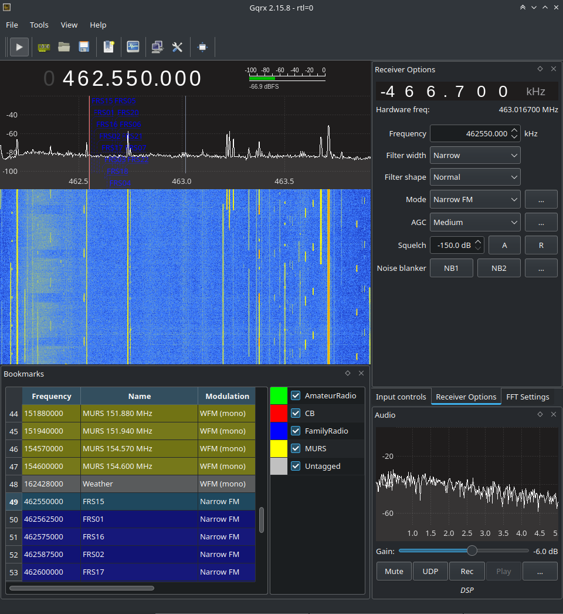

# gqrx-bookmarks

Bookmarks for GQRX: Community Broadcast CB, Family Radio, etc.

## Why

For the life of me I could not find an existing set of GQRX bookmarks/presets for common stations.

## Installation

1. Locate your GQRX configuration folder
  - This is probably `~/.config/gqrx`
2. Copy the `bookmarks.csv` file to this directory
3. Launch GQRX

## Screenshot

